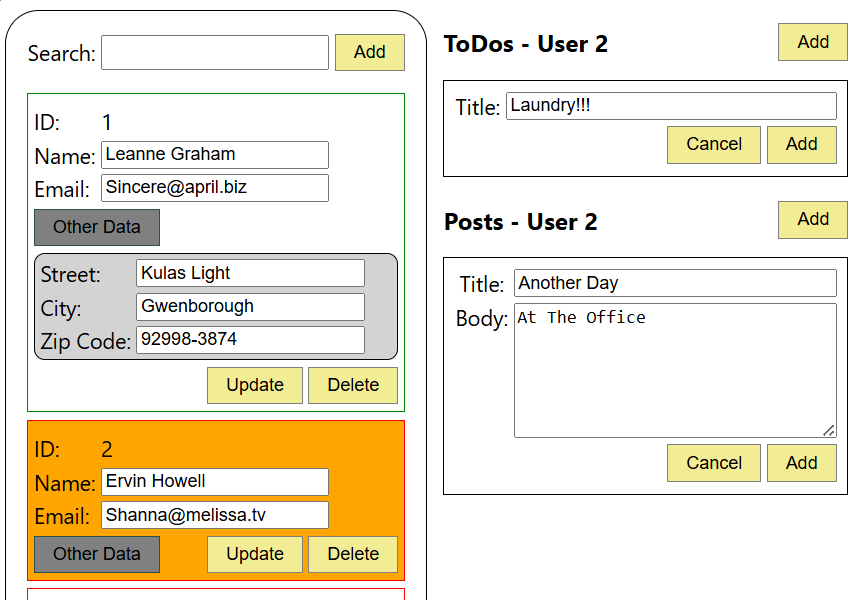

# Sample React.js App + Typescript

(See other branches for different implementations)

The app manages users personal details, with their list of todo items and posts.

* Managing data pulled from dummy api [jsonplaceholder](https://jsonplaceholder.typicode.com/)
* Data is presented with React
  
Project goal is to learn **React.js** basics, **Typescript** and practice **CSS**.

Changing views, managing states, dividing to components and communicating between child and parent components with parameters and callback functions.

